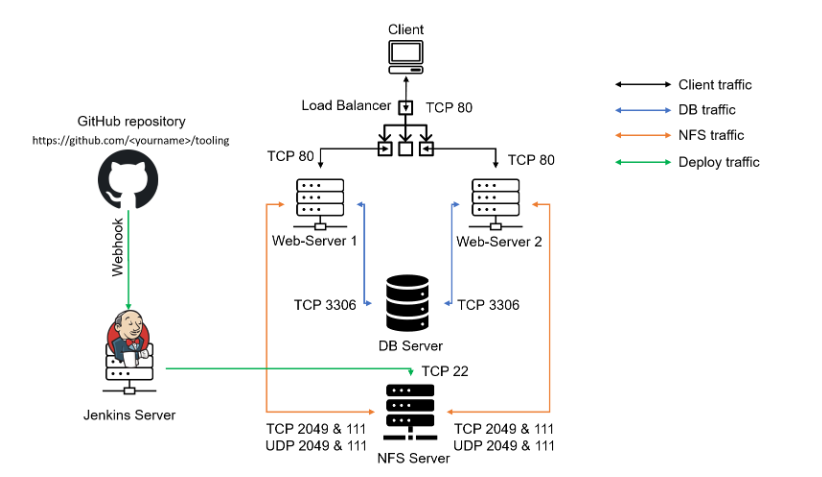
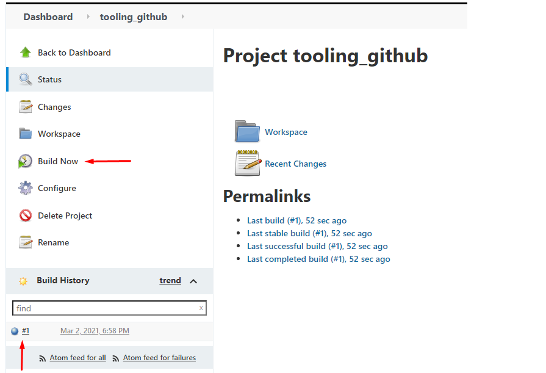

## **CONTINUOUS INTEGRATION WITH JENKINS **

Enhance the architecture prepared in Project 8 by adding a Jenkins server, configure a job to automatically deploy source codes changes from Git to NFS server.

Here is how your updated architecture will look like upon competition of this project:



1. Install Jenkins server.
- Create an AWS EC2 server based on Ubuntu server and name is Jenkins Server
- Install JDK (Java Development Kit since Jenkins is a Java-based application)

``````
sudo apt update
sudo apt install default-jdk-headless
``````
- Install Jenkins

``````
curl -fsSL https://pkg.jenkins.io/debian-stable/jenkins.io-2023.key | sudo tee \
  /usr/share/keyrings/jenkins-keyring.asc > /dev/null
echo deb [signed-by=/usr/share/keyrings/jenkins-keyring.asc] \
  https://pkg.jenkins.io/debian-stable binary/ | sudo tee \
  /etc/apt/sources.list.d/jenkins.list > /dev/null
sudo apt-get update
sudo apt-get install jenkins
``````

- Make sure Jenkins is up and running

    `sudo systemctl status jenkins`

- By default Jenkins server uses TCP port 8080 – open it by creating a new Inbound Rule in your EC2 Security Group

- Perform initial Jenkins setup.
From your browser access http://<Jenkins-Server-Public-IP-Address-or-Public-DNS-Name>:8080

- You will be prompted to provide a default admin password


- We will retrieve the password from the jenkins server

    `sudo cat /var/lib/jenkins/secrets/initialAdminPassword`

- Then you will be asked which plugins to install – choose suggested plugins.


- Once plugins installation is done – create an admin user and you will get your Jenkins server address.

- After this installation is complete as shown below.


2. Configure jenkins to retrieve source code from GitHub using webhooks.

- First we will enable webhook in the github repository of the project. 


- Next we will go to Jenkins web console, click "New Item" and create a "Freestyle Project".

- Afte that we will connect to our GitHub repository by using the project URL. 

- In configuration of your Jenkins freestyle project choose Git repository, provide there the link to your Tooling GitHub repository and credentials (user/password) so Jenkins could access files in the repository.


- Save the configuration and let us try to run the build. For now we can only do it manually.
Click “Build Now” button, if you have configured everything correctly, the build will be successfull



- We can open the build and check in “Console Output” it has run successfully

3. Click “Configure” your job/project and add these two configurations Configure triggering the job from GitHub webhook.


- Configure “Post-build Actions” to archive all the files – files resulted from a build are called “artifacts”.


- Now, go ahead and make some change in any file in your GitHub repository (e.g. README.MD file) and push the changes to the master branch

- You will see that a new build has been launched automatically (by webhook) and you can see its results – artifacts, saved on Jenkins server.

- You have now configured an automated Jenkins job that receives files from GitHub by webhook trigger (this method is considered as ‘push’ because the changes are being ‘pushed’ and files transfer is initiated by GitHub).

- By default, the artifacts are stored on Jenkins server locally


`ls /var/lib/jenkins/jobs/tooling_github/builds/<build_number>/archive/`

3. Configure jenkins to copy files to NFS Server via SSH

- Now we have our artifacts saved locally on Jenkins server, the next step is to copy them to our NFS server to /mnt/apps directory.

- First we will download "Publish Over SSH" plugin and install it.

- On main dashboard select “Manage Jenkins” and choose “Manage Plugins” menu item.

- On “Available” tab search for “Publish Over SSH” plugin and install it 

- On main dashboard select “Manage Jenkins” and choose “Configure System” menu item.

- Scroll down to Publish over SSH plugin configuration section and configure it to be able to connect to your NFS server


- Save the configuration, open your Jenkins job/project configuration page and add another one “Post-build Action”